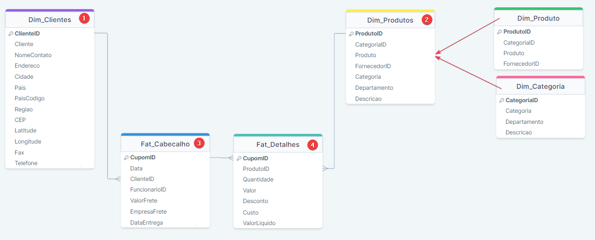
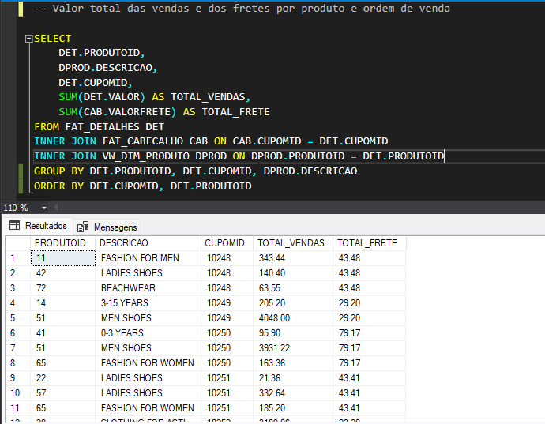
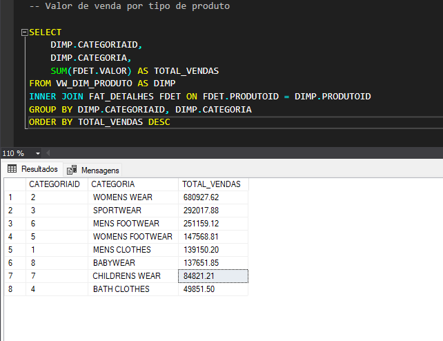
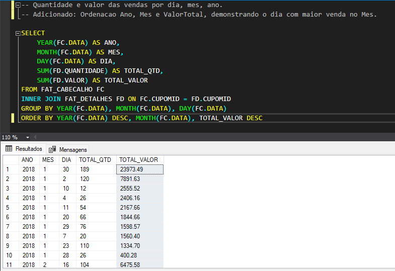
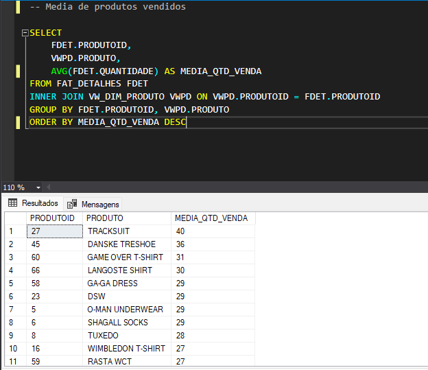
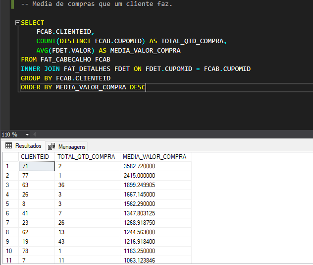
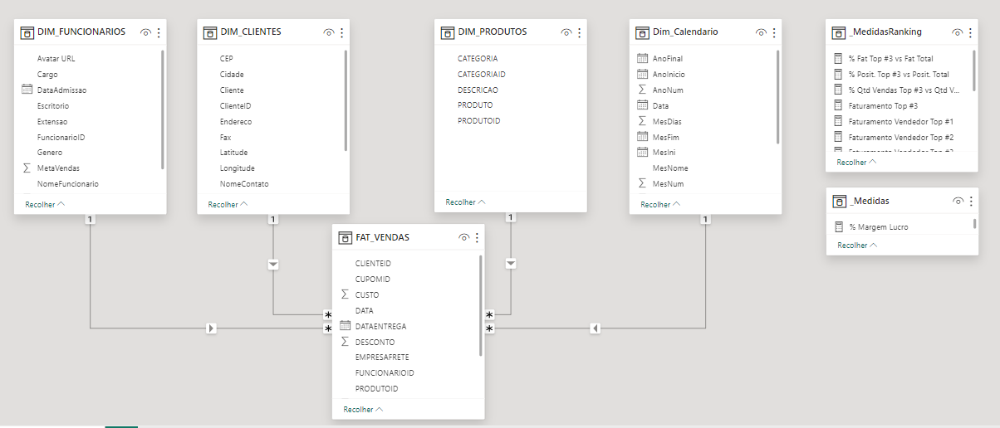

# Teste Habilidades Técnicas: William Silva - **Refera**

>* Teste de habilidades técnicas em querys SQL.
>* Avaliação de entendimento e coleta de informações da base de dados

####  Como Resultado do meu teste estou disponibilizando:
1. Querys SQL: scripts salvos na pasta /ScriptsSQL
2. **Bonus**: Dashboard PowerBi: arquivo pbix salvo na pasta /Bonus - Dashboard REFERA

##  1. ⚛️ Teste Querys:

#### 1. Ao fazer o teste ultilizei o SQL Server, fiz as importações da base de dados csv, xlsx e txt.

#### 2. Para entendimento da base de dados fiz um mapeamento das tabelas ultilizando DrawSQL

#### 3. Iniciei o teste criando uma view dimensão produto para integrar as informações de Produto e Categoria (DIM_PRODUTOS).

## Perguntas que precisam ser respondidas:

1. Valor total das vendas e dos fretes por produto e ordem de venda;

2. Valor de venda por tipo de produto;

3. Quantidade e valor das vendas por dia, mês, ano;

4. Lucro dos meses;

5. Venda por produto;

6. Venda por cliente, cidade do cliente e estado;

7. Média de produtos vendidos;

8. Média de compras que um cliente faz.

##  2. 📊Dashboard PowerBi:

* Após desenvolver as Querys SQL, desenvolvi proativamente dashboard em PowerBi analisando os dados da base compartilhada.
* Para desenvolver o Dashboard importei as tabelas do próprio SQL Server.
* No SQL criei uma view Fat_Vendas integrando informações das bases detalhes e cabeçalho vendas.

* Desenvolvi 3 telas com as análises: vendas, lucro e performance da equipe.
* Todo o Design foi desenvolvido no Figma.

> ### Estou entusiasmado com a oportunidade de contribuir para sua equipe, trazendo minha paixão pela tecnologia, habilidades técnicas e experiência prática para o time Refera.
> ### Agradeço antecipadamente por considerar minha candidatura 👍.
> ### Atenciosamente, William Silva 😊.
>:)</>
