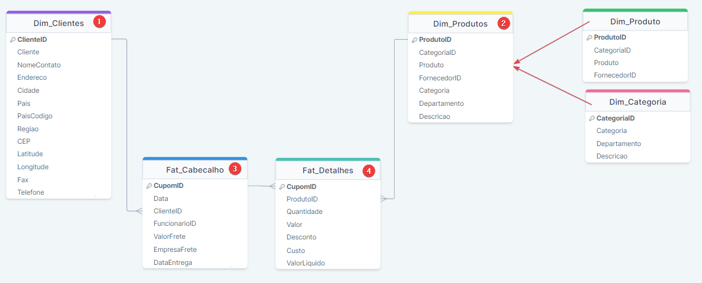
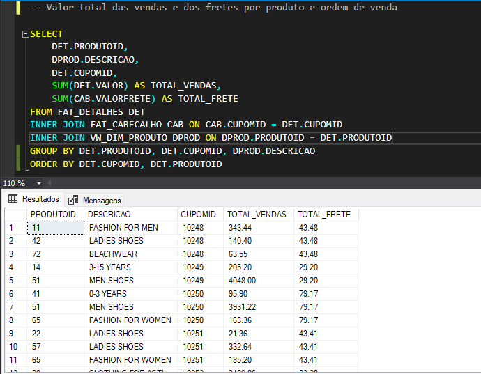
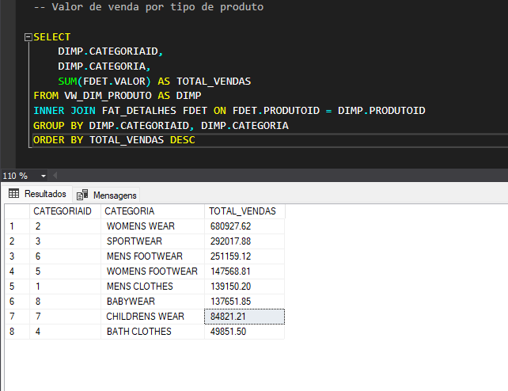
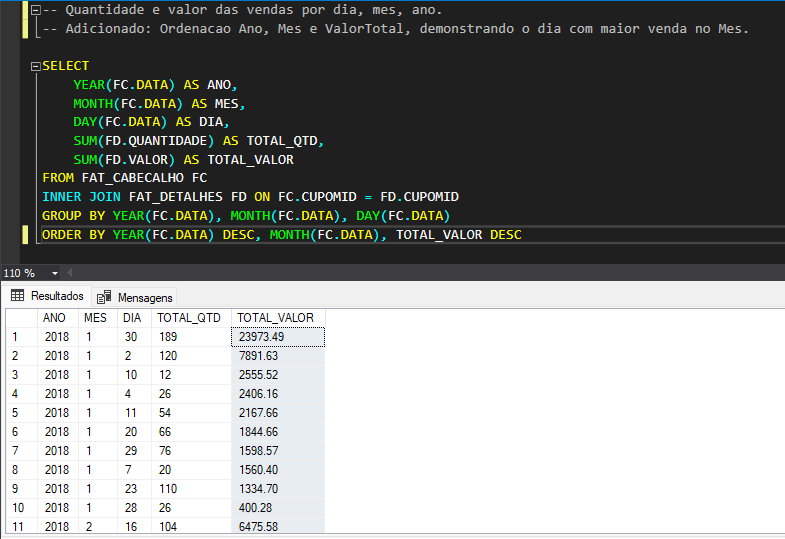
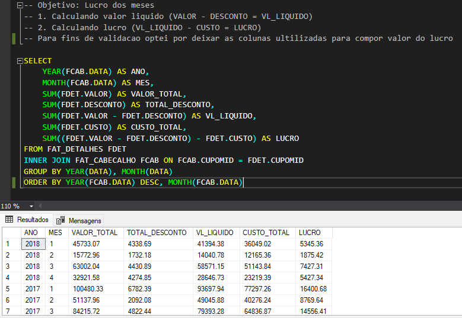
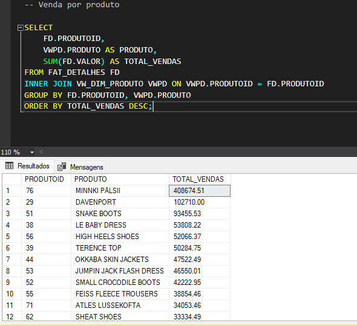
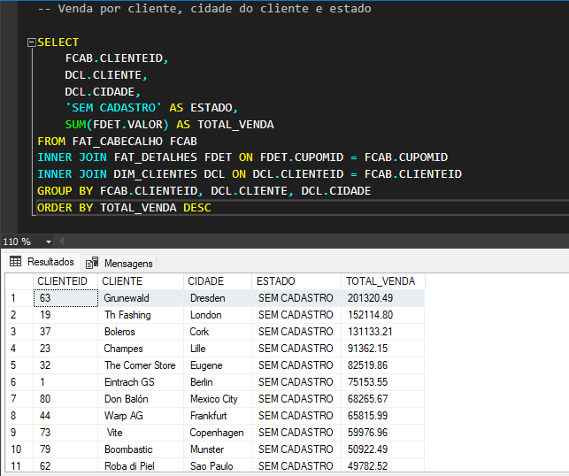
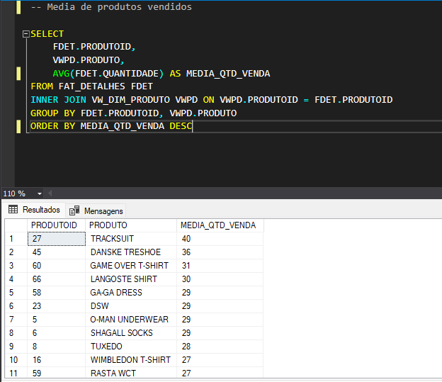
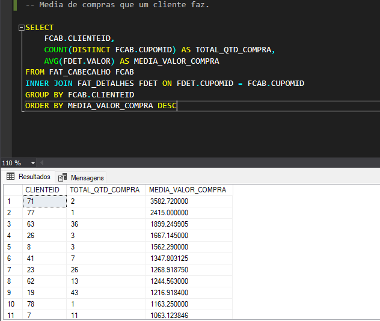
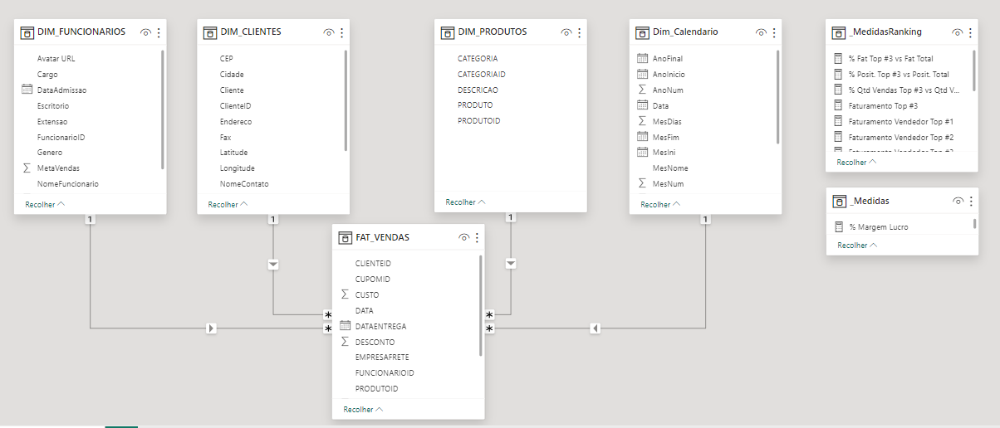

# Teste Habilidades Técnicas: William Silva - **Refera**

📃 Desafio 1: Teste de habilidades técnicas em querys SQL.

>* Teste de habilidades técnicas em querys SQL.
>* Avaliação de entendimento e coleta de informações da base de dados

####  Como Resultado do meu teste estou disponibilizando:
1. Querys SQL: scripts salvos na pasta /ScriptsSQL
2. **Bonus**: Dashboard PowerBi: arquivo pbix salvo na pasta /Bonus - Dashboard REFERA

##  1. ⚛️ Teste Querys:

#### 1. Ao fazer o teste ultilizei o SQL Server, fiz as importações da base de dados csv, xlsx e txt.

#### 2. Para entendimento da base de dados fiz um mapeamento das tabelas ultilizando DrawSQL

#### 3. Iniciei o teste criando uma view dimensão produto para integrar as informações de Produto e Categoria (Dim_Produtos).

## Perguntas que precisam ser respondidas:

1. Valor total das vendas e dos fretes por produto e ordem de venda;

2. Valor de venda por tipo de produto;

3. Quantidade e valor das vendas por dia, mês, ano;

4. Lucro dos meses;

5. Venda por produto;

6. Venda por cliente, cidade do cliente e estado;

7. Média de produtos vendidos;

8. Média de compras que um cliente faz.

##  2. 📊Dashboard PowerBi:

* Após desenvolver as Querys SQL, desenvolvi proativamente dashboard em PowerBi analisando os dados da base compartilhada.
* Para desenvolver o Dashboard importei as tabelas do próprio SQL Server.
* No SQL criei uma view Fat_Vendas integrando informações das bases detalhes e cabeçalho vendas.

* Desenvolvi 3 telas com as análises: vendas, lucro e performance da equipe.
* Todo o Design foi desenvolvido no Figma.

> ### Estou entusiasmado com a oportunidade de contribuir para sua equipe, trazendo minha paixão pela tecnologia, habilidades técnicas e experiência prática para o time Refera.
> ### Agradeço antecipadamente por considerar minha candidatura 👍.
> ### Atenciosamente, William Silva 😊.
>:)</>

#### ➡️ Desafio 2: Relatório BI e descritivo das análises.

**Objetivo:** 
Fazer análises fornecendo insigts sobre a base de dados do desafio 1, use uma ferramenta de BI para demonstrar os insigts relativos a:
•	Produtos / Serviços de alto e baixo desempenho
•	Problemas de Vendas
•	Oportunidades de Mercado
•	Previsão de Vendas
•	Atividades de Vendas que geram receita

Disponibilizar o relatório BI e um arquivo texto explicativo do desenvolvimento.

**Entrega:**
 - Estou disponibilizando o arquivo Word.docx na pasta: Desafio_02/
 - Estou disponibilizando o arquivo PowerBi.pbix na pasta: Dashboard - Refera - Desafio_02/

**Desenvolvimentos:**
Minha ferramenta de desenvolvimento foi o Power Bi.
1.	Iniciei o desafio desenhando as tabelas no DrawSQL, garantindo uma estrutura sólida para a base de dados. 
2.	Importei os dados do SQL com a conexão nativa do Power Bi.
3.	Tratei os dados minuciosamente no Power Query, priorizando a precisão e a integridade dos dados. 
4.	Ao compreender os requisitos do projeto, desenvolvi medidas DAX relevantes para criar análises significativas. 
5.	Após análises significativas identifiquei a necessidade de tabelas auxiliares em meu modelo, então criei tabelas com DAX e Power Query.
6.	Os layouts visuais desenvolvi no Figma, concentrei-me na disposição dos elementos para fornecer um dashboard claro e informativo. 

Foi um grande desafio fazer as análises de previsão, então para isto fiz algumas pesquisas na web, vi algumas lives de desenvolvimento comercial para que eu absorvesse conhecimentos significativos para este desenvolvimento, foi uma ótima oportunidade de aprendizado, onde pude desenvolver as análises de Previsão de Vendas e recomendação de produtos combinados, uffs 😅foi desafiador e muito top👍.

Apliquei melhores práticas em cada etapa, desde a limpeza dos dados até a apresentação dos insights, destacando não apenas minha competência técnica, mas também meu comprometimento com a entrega de análises impactantes para o negócio.

**Telas Desenvolvidas:**

**Insigts Dashboard:** 

**•	Página: Detalhe Lucro**

Insights Potenciais:

-	Temos Europa liderando Vendas na categoria Womens Wear e SportWear
- Região da Europa contribui 85% no lucro das vendas, com categoria Womens Wear, Sportwear, Mens Footwear liderando vendas na região
- Região da América do sul contribui com somente 5% no lucro, com categoria Womens Wear, Womens, Sportwear liderando vendas na região
- Pode ser boa estratégia movimentar campanhas de vendas para: Mens Footwear, BabyWear, Mens Clothes, pois são categorias que movimentam 38% na Europa e indicam tendencias de compra
- Buscar meios de redução de custo para regiões das Americas pois conta com um custo de 80% sobre o faturamento, enquanto a região da Europa tem uma relação de 70% de custo.

**•	Página: Performance Vendedor**

Insights Potenciais:

- No ranking de vendas temos Helen Brolin como top 1 e Rob Carsson, Lennart Skoglund 2° e 3° lugar.
- Temos como destaque que Helen Brolin conseguiu o dobro do faturamento que o 2° e 3° lugar.
- Pico de vendas em janeiro, queda em fevereiro e retomada de crescimento a partir de Março

**•	Página: Realizado vs Meta**

Insights Potenciais:

- Ao analisar Faturamento x Meta é possível observar que não houve meta alcançada em 2018 até o mês de Abril.
- Mesmo com os picos de vendas em Março/2018 o faturamento ficou 38% abaixo da meta.

 
- É uma boa estratégia fazer reuniões com os funcionários que faltam mais de 60% da meta, o top 2 vendas do Ranking Rob Carsson por exemplo está com uma demanda de 70% para bater a meta.

 
- é possível notar uma disparidade de vendas de um único produto, o Minnki Pâlsii com faturamento de 47k contra o segundo produto mais vendido Le Baby Dress 9,8k, logo o foco de vendas em um único produto pode ter desiquilibrado as vendas.
- Também é possível notar que o produto Minnki Pâlsii teve vendas focadas somente em janeiro e abril, fazer campanhas para outros meses pode equilibrar o faturamento.

 

**•	Página: Previsão de Vendas**

Insights Potenciais:

- Análise dos dados para compreender melhor a diferença entre a previsão e a meta estabelecida
- No caso do mês de abril é possível perceber que a previsão é que o faturamento feche o mês % abaixo da meta.
- Com essa visão é possível traçar um plano de ação para que a meta seja 100% atingida antes do final do mês.
 

**•	Página: Ranking Produtos (TopN)**

Insights Potenciais:

Nessa tela foi feita uma segmentação dos produtos com base no lucro, com isso é possível entender:
- Quais são os produtos mais lucrativos e suas características comuns.
- Como está a geográfica do lucro
- Qual o percentual de contribuição de cada vendedor em cada segmentação do lucro
A partir desses dados é possível tomar ações como:
- Realizar ação para aumentar o lucro dos produtos com baixo lucro.
- Incentivar os vendedores a trabalharem melhor a negociação dos produtos com baixo lucro.

**•	Página: Análise ABC (produto)**

Esta página segmenta os produtos nas Classes A, B e C para entendermos melhor o desempenho dos produtos. É possível entender:

Insights Potenciais:

- Quais são os produtos de Classe A, ou seja, com melhor desempenho e qual a representatividade desses itens no meu lucro
- Quais são os produtos de Classe B e C e sua representatividade no lucro
A partir desses dados é possível tomar ações como:
- Plano de aumentar a margem de lucro dos produtos de Classe B e C
- Planejar ação promocional com vendas casadas por exemplo, criando assim um mix de produtos A, B e C onde a compra de um item força a saída do outro produto do mix
Ainda nessa página é possível ter uma análise descritiva da segmentação que foi feita utilizando a Inteligência Artificial nativa do Power BI, ainda no contexto de análises com inteligência artificial nativa do Power BI, é possível explicar um aumento ou diminuição de um ponto de dados como mostrado no gif.

Pelo Gif, estamos tentando entender o que houve em fevereiro de 2018 que o lucro da Classe A caiu, a IA nativa mostra dentre outras coisas que o ProdutoID 78 foi o maior responsável pela queda de rendimento dos produtos de Classe A.

 
**•	Página: Itens Recomendados**

Insights Potenciais:

- Como Melhoria nas Vendas desenvolvi uma tela com recomendações de produtos, onde é feita a seguinte análise: A partir do produto filtrado em uma lista, quais foram os produtos que também foram comprados juntos pelo cliente na mesma nota fiscal.
- Com base nesta análise é possível descobrir a lista de produtos que tem uma combinação percentual maior e recomendá-los na cesta de carrinho dos clientes como estratégias de promoção cruzada.
- A partir desta lista de itens recomendados podemos mapear as escolhas dos clientes da América do Norte e Sul e fazendo vendas combinadas aumentar o faturamento.

 

**•	Página: Itens sem Vendas**

Esta tela foi construída para entender melhor quais produtos do meu mix de produtos não estão saindo.

Insights Potenciais:

- Qual a quantidade de itens do meu portfólio que não estão sendo vendidos
- Quais são os produtos do meu portfólio que não estão sendo vendidos
Com base nessas análises é possível tomar ações como:
- Planejar ação promocional com vendas casadas por exemplo, criando assim um mix de produtos A, B e C onde a compra de um item força a saída do outro produto do mix
- Entender quais itens estão obsoletos, ou seja, podem ser retirados do portfólio
- Entender quais itens fazem mais sentido aumentar ou diminuir estoque/produção

🔅Estou entusiasmado com a oportunidade de contribuir para sua equipe, trazendo minha paixão pela tecnologia, habilidades técnicas e experiência prática para o time Refera, ao longo de todos estes desafios já me sinto parte da equipe e aguardo poder conhecer todos do time Refera.
Agradeço antecipadamente por considerar minha candidatura 👍.
Atenciosamente, William Silva 😊.

